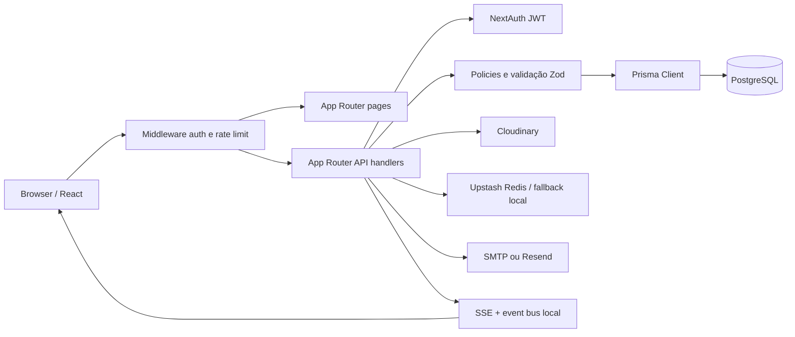

# Arquitetura do CheerConnect

## Visão geral

O sistema adotou um monólito modular em Next.js App Router. A camada de apresentação consome route handlers autenticados; os handlers aplicam políticas de autorização, validação Zod e regras de ownership antes de chamar o Prisma.

## Módulos

- `src/app/api/auth`: registro, verificação de e-mail e sessão.
- `src/app/api/posts`, `comments`, `tags`: feed, menções, hashtags e busca.
- `src/app/api/connections`, `conversations`: conexões, bloqueios e mensagens.
- `src/app/api/teams`: equipes, membros, convites e permissões.
- `src/app/api/events`: eventos, calendário, filtros e paginação.
- `src/app/api/users`, `settings`, `privacy`, `reports`: perfil, preferências, LGPD e moderação.
- `src/lib/media-assets.ts`, `file-validation.ts` e `image-dimensions.ts`: inventário e validação de mídia.
- `src/lib/realtime-bus.ts`:_EVENTS em processo para reduzir latência; polling degraded permanece como fallback para múltiplas instâncias.

## Fluxos críticos

### Publicação com mídia

1. O cliente solicita uma assinatura em `/api/upload/sign`.
2. O servidor cria um `MediaAsset` pendente ligado ao usuário e uma pasta específica do usuário.
3. O cliente envia o arquivo ao Cloudinary e confirma URL, public ID, bytes e dimensões em `/api/upload/complete`.
4. O post só vincula assets concluídos cujo `ownerId` e pasta pertencem ao autor.
5. A exclusão consulta ownership no banco antes de remover o asset externo.

### Mensagens e tempo real

1. A conexão é verificada novamente no envio, mesmo que a conversa já exista.
2. Mensagens são criadas em transação junto com preview e notificação.
3. O processo publica um evento local; streams SSE consultam imediatamente e mantêm polling de fallback.
4. Bloqueios são verificados no acesso à conversa, no stream e no envio.

### Permissões de equipe

`src/lib/team-permissions.ts` é a fonte da matriz. Administradores recebem permissões operacionais básicas por invariante; `canEdit`, `canPost`, `canInvite`, `canManageMembers` e `canDeleteTeam` são persistidos separadamente. Alterações que removem o último administrador usam transação serializável.

## Segurança e privacidade

- E-mail verificado é obrigatório para concluir o cadastro, acessar APIs e excluir a conta.
- Login por credenciais e OAuth exigem `emailVerified`; Google só cria/entra com `email_verified` verdadeiro.
- `tokenVersion` invalida JWTs após troca de senha, exclusão de conta ou remoção no banco.
- Exclusão de conta exige e-mail verificado, username e challenge universal por e-mail, de uso único e vinculado à sessão.
- Solicitações assíncronas de exclusão em `PrivacyRequest` exigem a mesma prova e não são processadas sem `reauthVerifiedAt`.
- Respostas personalizadas usam `private, no-store`.
- URLs externas aceitam somente `http` e `https`.
- Assets têm owner, public ID, finalidade, tamanho e dimensões.
- Auditoria possui prazo de retenção e rotina de anonimização.
- Exportação de dados está em `/api/privacy/export` e solicitações em `/api/privacy/request`.
- Rotinas de manutenção são protegidas por `CRON_SECRET` e agendadas em `vercel.json`.

## Operação

- `GET /api/health` verifica PostgreSQL.
- `POST /api/cron/maintenance` expira convites, remove notificações antigas, anonimiza auditoria e limpa assets pendentes.
- `POST /api/cron/cleanup-invites` mantém a rotina legada de convites.
- `npm run test:coverage` gera relatório em `coverage/`.
- `npm run test:e2e` executa o smoke suite Playwright com Chromium.
