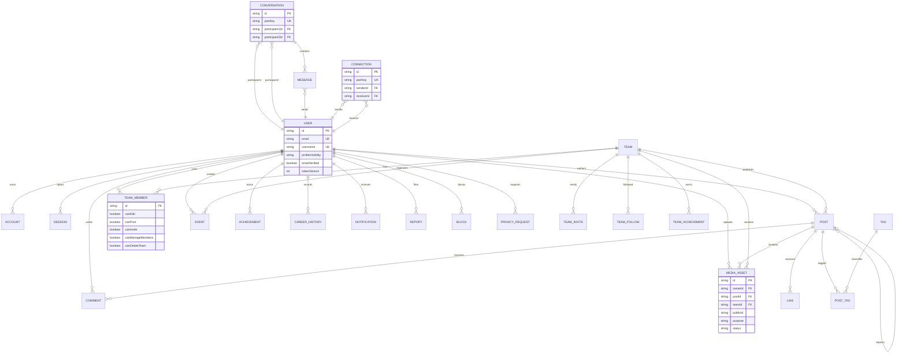

# Modelo entidade-relacionamento

`pairKey` is derived from the two participant IDs and has a unique index, preventing duplicate connections and conversations when requests arrive concurrently in opposite directions. `MediaAsset` is the ownership boundary for Cloudinary resources. Audit records intentionally keep a nullable actor and retention metadata so historical events can be anonymized without retaining unnecessary personal data.
